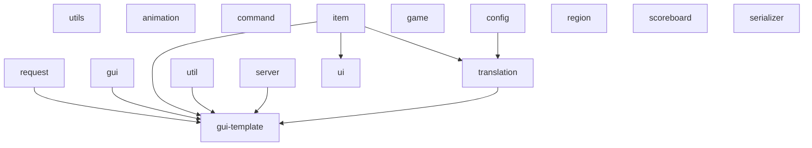

# CodeDoctorAPI

My own api for my plugins.

JavaDocs: <https://codedoctor.tk/CodeDoctorAPI>

## Structure

```mermaid
graph TD
  utils
  animation
  command
  config
  game
  item
  region
  request
  scoreboard
  serializer
  server
  translation
  gui
  gui-template
  util
  request
  item --> translation
  config --> translation
  item --> ui
  request --> gui-template
  gui --> gui-template
  item --> gui-template
  util --> gui-template
  server --> gui-template
  translation --> gui-template
```